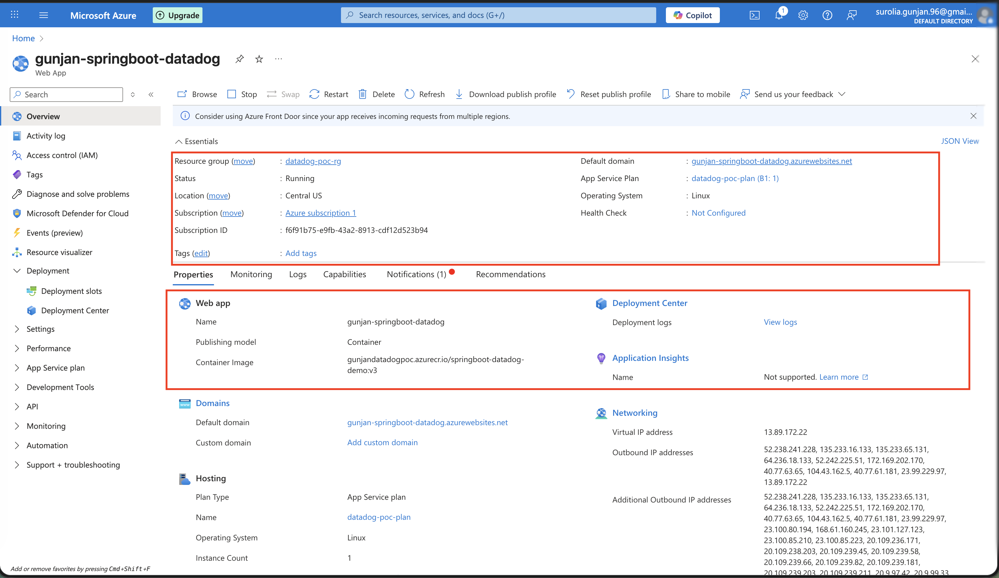
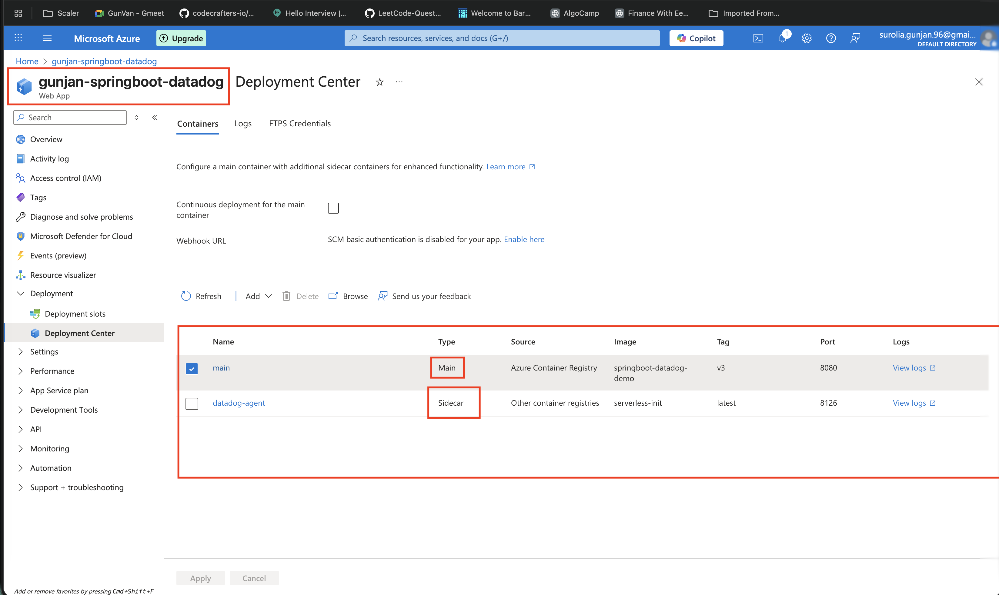
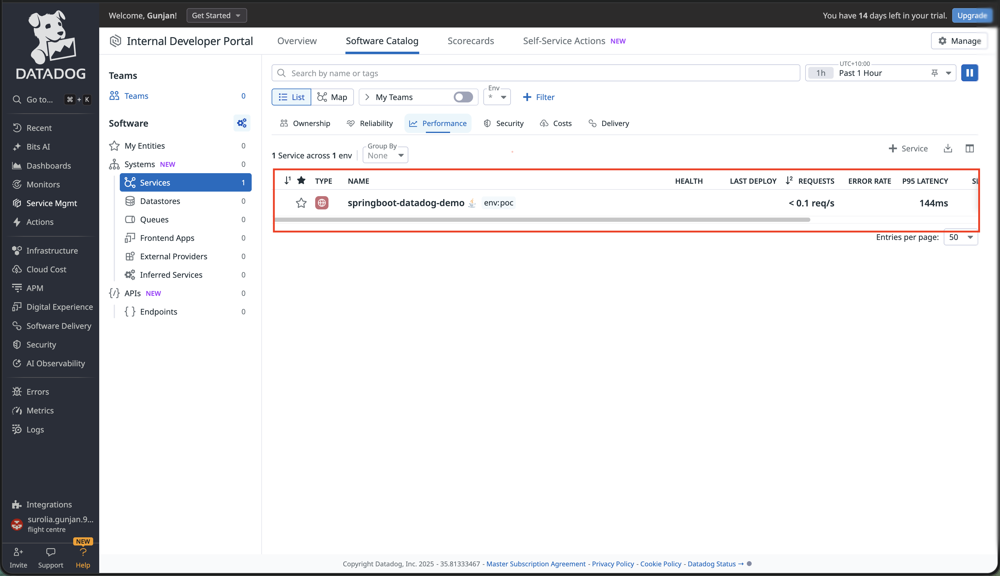
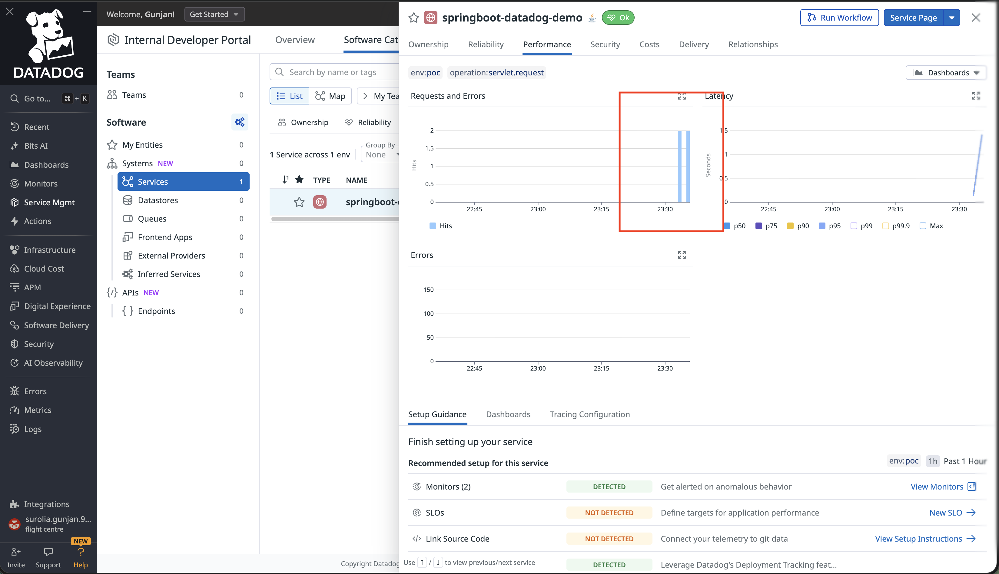

# Spring Boot + DataDog Observability POC

A proof-of-concept demonstrating **DataDog observability integration** with a **Spring Boot application** deployed on **Azure App Service** using the **sidecar container pattern**.

## 🎯 Overview

This project showcases how to integrate DataDog monitoring and observability into a Java Spring Boot application running in Azure App Service with sidecar containers. The setup includes:

- **Application Monitoring**: Traces, logs, and custom metrics
- **Sidecar Pattern**: DataDog agent running alongside the main application
- **Container Deployment**: Docker-based deployment on Azure App Service
- **Cloud-Native Architecture**: Scalable and production-ready setup

## 🏗️ Architecture
```
┌──────────────────────────────────────────────┐
│   Azure App Service (Linux Containers)       │
│                                              │
│  ┌────────────────┐    ┌──────────────────┐ │
│  │  Spring Boot   │    │  DataDog Sidecar │ │
│  │  Container     │◄──►│  Agent           │ │
│  │  (Port 8080)   │    │  (Port 8126)     │ │
│  │                │    │                  │ │
│  │  - REST APIs   │    │  - Collects logs │ │
│  │  - dd-trace    │    │  - APM traces    │ │
│  │  - Logging     │    │  - Metrics       │ │
│  └────────────────┘    └──────────────────┘ │
│          │                      │            │
└──────────┼──────────────────────┼────────────┘
           │                      │
           │                      ▼
           │         ┌────────────────────────┐
           │         │   DataDog Platform     │
           │         │   (ap2.datadoghq.com)  │
           │         │                        │
           │         │  - Dashboards          │
           │         │  - Alerts              │
           │         │  - Analytics           │
           │         └────────────────────────┘
           │
           ▼
    User API Requests
```

## 📋 Prerequisites

- **Java 21** (OpenJDK or Eclipse Temurin)
- **Maven 3.9+**
- **Docker Desktop** (for building containers)
- **Azure CLI** (for deployment)
- **Azure Account** (free tier is sufficient)
- **DataDog Account** (free trial available)

## 🛠️ Technology Stack

| Technology | Version | Purpose |
|------------|---------|---------|
| Java | 21 | Application runtime |
| Spring Boot | 3.3.5 | Application framework |
| Maven | 3.9.9 | Build tool |
| Docker | latest | Containerization |
| DataDog Java Tracer | latest | APM instrumentation |
| Azure App Service | B1 | Hosting platform |
| Azure Container Registry | Basic | Container storage |

## 📁 Project Structure
```
springboot-datadog-demo/
├── src/
│   └── main/
│       ├── java/com/example/demo/
│       │   ├── DemoApplication.java
│       │   └── controller/
│       │       └── DemoController.java
│       └── resources/
│           ├── application.properties
│           └── logback-spring.xml
├── scripts/
│   ├── azure-setup.sh
│   └── cleanup.sh
├── docs/
│   └── ARCHITECTURE.md
├── Dockerfile
├── pom.xml
├── .dockerignore
├── .gitignore
└── README.md
```

## 🔧 Local Development

### 1. Clone the Repository
```bash
git clone https://github.com/YOUR_USERNAME/springboot-datadog-demo.git
cd springboot-datadog-demo
```

### 2. Build the Application
```bash
mvn clean package
```

### 3. Run Locally
```bash
java -jar target/springboot-datadog-demo-1.0.0.jar
```

The application will start on `http://localhost:8080`

### 4. Test Endpoints
```bash
# Home endpoint
curl http://localhost:8080/

# Health check
curl http://localhost:8080/health

# Test endpoint
curl http://localhost:8080/api/test

# Trigger metrics
curl -X POST http://localhost:8080/api/metrics \
  -H "Content-Type: application/json" \
  -d '{"test":"data"}'
```

## 🐳 Docker Build

### Build for AMD64 (for Azure deployment)
```bash
# Using buildx for cross-platform build
docker buildx build \
  --platform linux/amd64 \
  -t springboot-datadog-demo:latest \
  .
```

### Test Locally with Docker
```bash
docker run -p 8080:8080 springboot-datadog-demo:latest
```

## ☁️ Azure Deployment

### Prerequisites

1. **Azure Account Setup**
```bash
   # Login to Azure
   az login
```

2. **DataDog Account Setup**
   - Sign up at https://www.datadoghq.com/
   - Get your API key from Organization Settings

### Automated Deployment

Run the automated setup script:
```bash
# Make script executable
chmod +x scripts/azure-setup.sh

# Run the script
./scripts/azure-setup.sh
```

The script will prompt you for:
- Azure resource names
- DataDog API key
- DataDog site (e.g., ap2.datadoghq.com)
- 
## 🔍 API Endpoints

| Method | Endpoint | Description |
|--------|----------|-------------|
| GET | `/` | Home endpoint - returns welcome message |
| GET | `/health` | Health check endpoint |
| GET | `/api/test` | Test endpoint with random processing |
| POST | `/api/metrics` | Triggers custom metrics |
| GET | `/api/error` | Simulates an error for testing |

## 📊 DataDog Dashboard

After deployment, access your DataDog dashboard to view:

1. **Logs**: Navigate to Logs → Filter by `service:springboot-datadog-demo`
2. **APM**: Navigate to APM → Services → `springboot-datadog-demo`
3. **Infrastructure**: Navigate to Infrastructure → Host Map
4. **Metrics**: Create custom dashboards for your metrics

Data should appear within 2-5 minutes of the first API calls.

## 🧹 Cleanup

To avoid Azure charges, delete all resources after testing:
```bash
# Using the cleanup script
chmod +x scripts/cleanup.sh
./scripts/cleanup.sh

# Or manually
az group delete --name datadog-poc-rg --yes --no-wait
```

## 🔑 Environment Variables

The application uses the following environment variables:

| Variable | Description | Example |
|----------|-------------|---------|
| `DD_API_KEY` | DataDog API key | `abc123...` |
| `DD_SITE` | DataDog site URL | `ap2.datadoghq.com` |
| `DD_SERVICE` | Service name in DataDog | `springboot-datadog-demo` |
| `DD_ENV` | Environment name | `poc` |
| `DD_VERSION` | Application version | `1.0.0` |
| `LOG_PATH` | Log file location | `/home/LogFiles` |
| `WEBSITES_PORT` | App listening port | `8080` |

## 📸 Screenshots
### Console Screenshots







